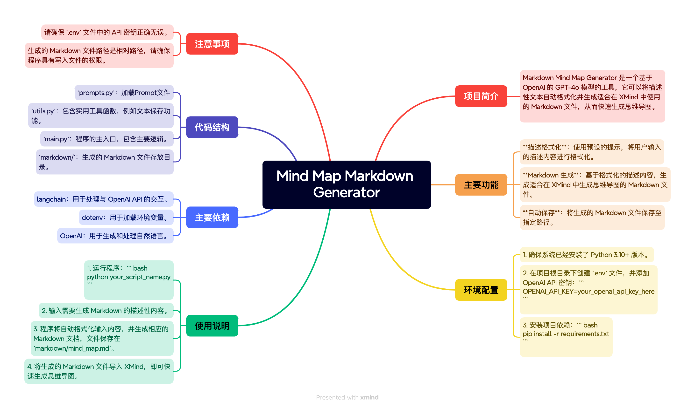

# Mind Map Markdown Generator

## 项目简介

Markdown Mind Map Generator 是一个基于 OpenAI 的 GPT-4o 模型的工具，它可以将描述性文本自动格式化并生成适合在 XMind 中使用的 Markdown 文件，从而快速生成思维导图。


## 主要功能

- **描述格式化**：使用预设的提示，将用户输入的描述内容进行格式化。
- **Markdown 生成**：基于格式化的描述内容，生成适合在 XMind 中生成思维导图的 Markdown 文件。
- **自动保存**：将生成的 Markdown 文件保存至指定路径。

## 环境配置

1. 确保系统已经安装了 Python 3.10+ 版本。
2. 在项目根目录下创建 `.env` 文件，并添加 OpenAI API 密钥：
    ```
    OPENAI_API_KEY=your_openai_api_key_here
    ```
3. 安装项目依赖：
    ```bash
    pip install -r requirements.txt
    ```

## 使用说明

1. 运行程序：
    ```bash
    python main.py
    ```
2. 输入需要生成 Markdown 的描述性内容。
3. 程序将自动格式化输入内容，并生成相应的 Markdown 文档，文件保存在 `markdown/mind_map.md`。
4. 将生成的 Markdown 文件导入 XMind，即可快速生成思维导图。

## 主要依赖

- [langchain](https://github.com/langchain-ai/langchain)：用于处理与 OpenAI API 的交互。
- [dotenv](https://github.com/theskumar/python-dotenv)：用于加载环境变量。
- [OpenAI GPT-4](https://openai.com/)：用于生成和处理自然语言。

## 代码结构

- `prompts.py`：加载Prompt文件。
- `utils.py`：包含实用工具函数，例如文本保存功能。
- `main.py`：程序的主入口，包含主要逻辑。
- `markdown/`：生成的 Markdown 文件存放目录。

## 注意事项

- 请确保 `.env` 文件中的 API 密钥正确无误。
- 生成的 Markdown 文件路径是相对路径，请确保程序具有写入文件的权限。

## 贡献指南

欢迎提交 Issues 或 Pull Requests 来改进本项目。

## 许可证

本项目采用 MIT 许可证，详情请参阅 LICENSE 文件。
